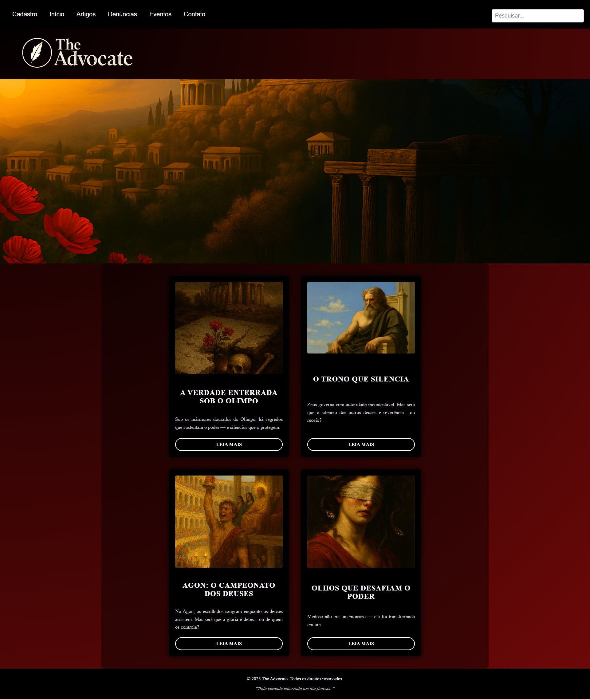
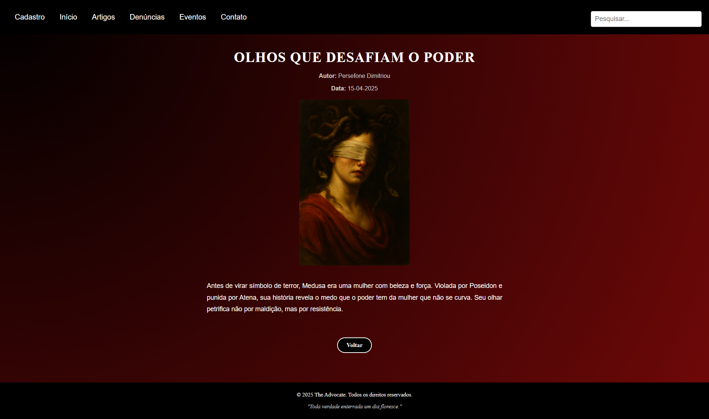

[](https://classroom.github.com/online_ide?assignment_repo_id=20905997&assignment_repo_type=AssignmentRepo)
# Trabalho Prático 05 - Semanas 7 e 8

**Páginas de detalhes dinâmicas**

Nessa etapa, vamos evoluir o trabalho anterior, acrescentando a página de detalhes, conforme o  projeto escolhido. Imagine que a página principal (home-page) mostre um visão dos vários itens que existem no seu site. Ao clicar em um item, você é direcionado pra a página de detalhes. A página de detalhe vai mostrar todas as informações sobre o item do seu projeto. seja esse item uma notícia, filme, receita, lugar turístico ou evento.

Leia o enunciado completo no Canvas. 

**IMPORTANTE:** Assim como informado anteriormente, capriche na etapa pois você vai precisar dessa parte para as próximas semanas. 

**IMPORTANTE:** Você deve trabalhar e alterar apenas arquivos dentro da pasta **`public`,** mantendo os arquivos **`index.html`**, **`styles.css`** e **`app.js`** com estes nomes, conforme enunciado. Deixe todos os demais arquivos e pastas desse repositório inalterados. **PRESTE MUITA ATENÇÃO NISSO.**

## Informações Gerais

- Nome: Gisele Rodrigues dos Santos
- Matricula: 903350
- Proposta de projeto escolhida: Proposta 3 – Organizações e Equipes, pois o The Advocate é um jornal fictício, ideia que retirei de um livro, que funciona como uma organização.
- Breve descrição sobre seu projeto: É um site fictício do jornal The Advocate, inspirado no livro de Hades e Persefone. O jornal atua como uma organização em Nova Atenas, publicando matérias investigativas, críticas e análises sobre os acontecimentos da cidade, revelando conspirações, disputas de poder entre os deuses e a influência deles sobre os mortais, conectando o leitor ao universo da obra de forma imersiva e narrativa.

## Print da Home-Page



## Print da página de detalhes do item



## Cole aqui abaixo a estrutura JSON utilizada no app.js

```javascript
const dados = [
  {
    id: 1,
    titulo: "A verdade enterrada sob o Olimpo",
    descricao: "Sob os mármores dourados do Olimpo, há segredos que sustentam o poder — e silêncios que o protegem.",
    conteudo: `
    <p>O Olimpo brilha. Mármore, ouro, trovões e glória. Mas sob seus pilares, há histórias que não foram contadas — e vozes que nunca foram ouvidas.</p>

    <p>Cada estátua esconde um silêncio. Cada mito, uma versão oficial. E cada deus, um papel cuidadosamente esculpido para manter a ordem.</p>

    <p>Este artigo não busca destruir o Olimpo — apenas escavar. Porque às vezes, o que sustenta o poder não é a verdade... mas o medo de revelá-la.</p>
  `,
    autor: "Persefone Dimitriou",
    data: "01-01-2025",
    imagem: "images/olimposoterrado.png"
  },
  {
    id: 2,
    titulo: "O trono que silencia",
    descricao: "Zeus governa com autoridade incontestável. Mas será que o silêncio dos outros deuses é reverência... ou receio?",
    conteudo: `
  <p>No Olimpo, há um trono que ninguém ousa contestar. Zeus, senhor dos céus e do raio, reina com autoridade absoluta — não apenas pela força de seus trovões, mas pela ordem que impõe ao cosmos.
  Seu poder é tão vasto que não precisa ser reafirmado: ele está presente no clima, nos juramentos, nas decisões que moldam o destino dos mortais e dos deuses.</p>
  <p>Mas o que acontece quando o poder é tão grande que ninguém se atreve a questioná-lo?</p>

  <p>Este artigo não busca acusar, mas refletir. Porque entender Zeus é entender o que acontece quando o poder se torna incontestável — e o silêncio, uma linguagem política.</p>
`,
    autor: "Persefone Dimitriou",
    data: "07-02-2025",
    imagem: "images/zeus.png"
  },
  {
    id: 3,
    titulo: "Agon: O Campeonato dos Deuses",
    descricao: "No Agon, os escolhidos sangram enquanto os deuses assistem. Mas será que a glória é deles... ou de quem os controla?",
    conteudo: `
  <p>No Olimpo, a glória não é concedida — é disputada. O <em>Agon</em>, campeonato sagrado dos deuses, não é apenas um torneio: é um ritual de poder, onde os escolhidos sangram para entreter quem já reina.</p>

  <p>Zeus observa do alto, Atena calcula cada movimento, e Ares vibra com o cheiro da guerra. Os semideuses lutam por honra, mas também por sobrevivência. Cada prova é uma metáfora: força, astúcia, resistência, fé. Mas o que está em jogo não é apenas a vitória — é a narrativa que será contada depois.</p>

  <p>Quem define os campeões? Quem escreve as regras? E quem lucra com o espetáculo?</p>

  <p>O Agon revela mais do que habilidade: revela o sistema. Porque quando os deuses competem, não é apenas por glória — é por controle da memória, da história e do mito.</p> 
  `,
    autor: "Persefone Dimitriou",
    data: "22-03-2025",
    imagem: "images/agoncampeonato.png"
  },
  {
  id: 4,
  titulo: "Olhos que desafiam o poder",
  descricao: "Medusa não era um monstro — ela foi transformada em um.",
  conteudo: "Antes de virar símbolo de terror, Medusa era uma mulher com beleza e força. Violada por Poseidon e punida por Atena, sua história revela o medo que o poder tem da mulher que não se curva. Seu olhar petrifica não por maldição, mas por resistência.",
  autor: "Persefone Dimitriou",
  data: "15-04-2025",
  imagem: "images/medusa.png"
}

];
```